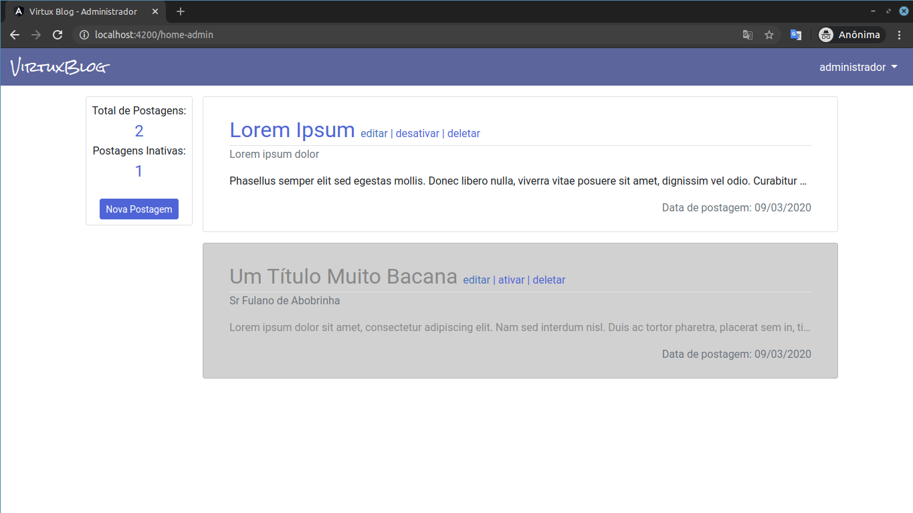
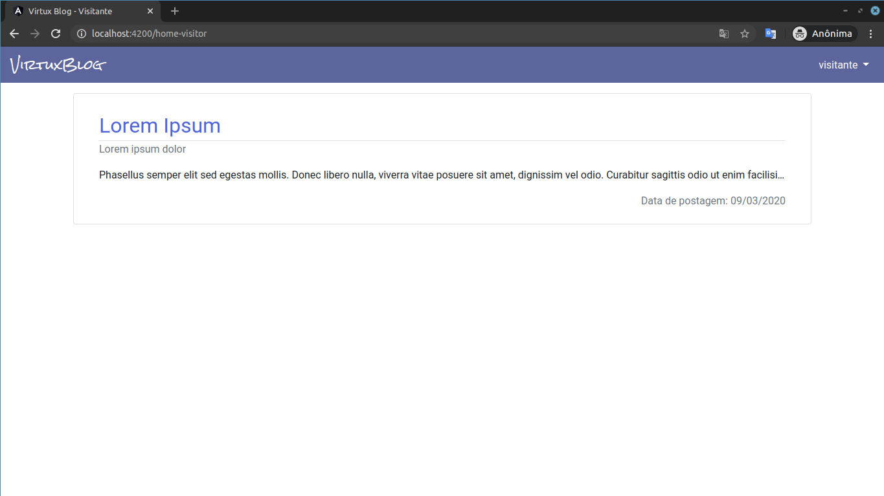
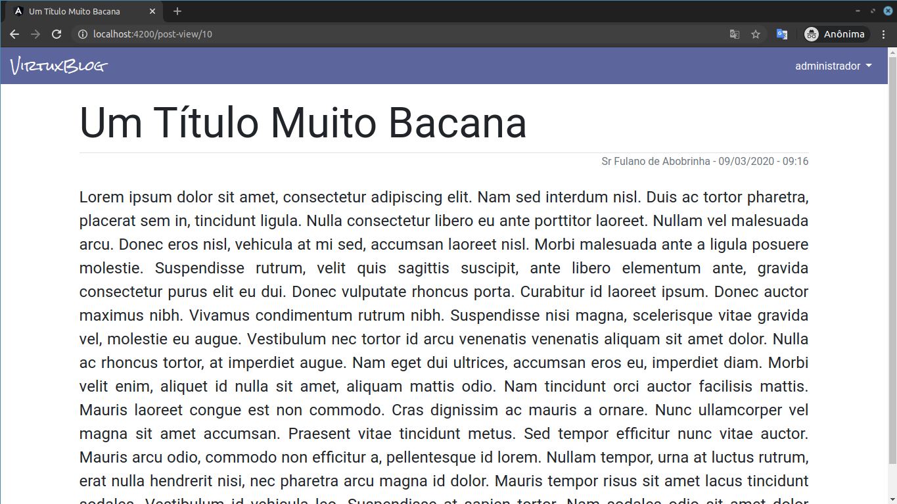
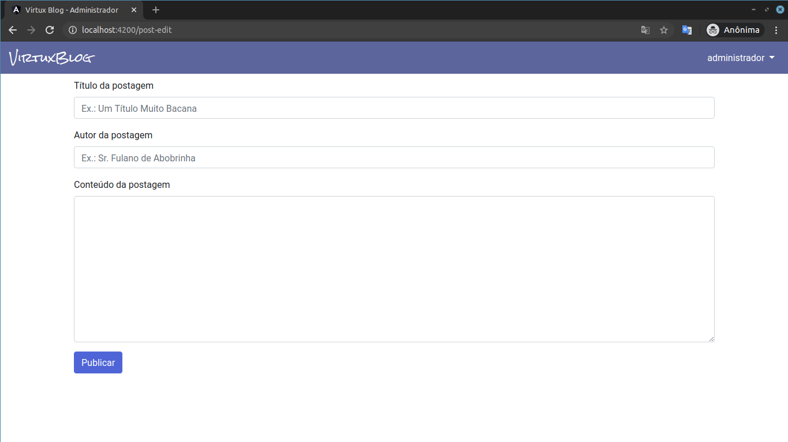

# Practicing-Angular-Blog
> Aplicação Blog construída utilizando Angular 8 (front-end) e NodeJs + Express (back-end)


## Screenshots da aplicação







## Execução do projeto

Partindo do pressuposto que existe uma instalação do NodeJS (projeto construído na versão 12.13.1), seguir os seguintes passos para execução do projeto: 

### Back-end:

Entrar na pasta "server" e instalar as dependências:
```
cd server
npm install
```

Este projeto foi construído utilizando o banco de dados MySQL, assim para rodar o projeto é necessário configurar o banco e preencher corretamente o arquivo de configuração "src/config/index.js"

Dentro da pasta server e com o banco devidamente configurado, executar o projeto com o seguinte comando:
```
npm start
```


### Front-end:

Entrar na pasta "client", instalar as dependências e rodar o projeto:
```
cd client
npm install
npm start
```